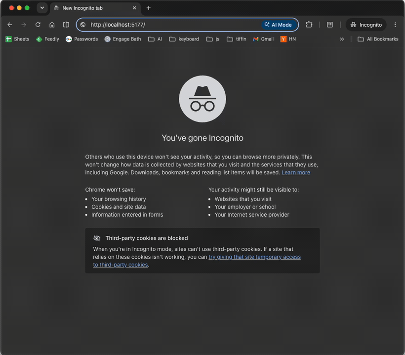

# streaming-partial

A page that streams its layout, flushes it, then fills the panels **out of
document order**.



## What it shows

Plain HTTP streaming can only append in document order. Processing-instruction
markers change that: a `<template for="x">` patches the region named `x`
*wherever that region already sits in the document*, so a later byte can fill an
earlier hole.

The panel latencies are deliberately inverted against the page order:

| panel         | position | latency |
| ------------- | -------- | ------- |
| Revenue       | first    | 2400 ms |
| Recent orders | second   | 400 ms  |
| Top products  | third    | 1200 ms |

Watch the middle panel fill while the one above it is still a skeleton. Each
panel is stamped with its arrival order and the measured milliseconds, so the
mismatch between page position and arrival order is visible at a glance. Those
numbers come from the server, not from the markup.

Three gsx features combine here:

- **processing instructions** — `<?start name="revenue"> … <?end>` marks a region
  the server can patch later
- **the streaming-flush pattern** — a `<Flush/>` node pushes bytes mid-render, so
  the browser paints the skeletons immediately
- **[gsxui](https://github.com/gsxhq/gsxui)** — the cards, table, badge and
  skeletons, vendored with `gsxui add`

## Read these four files

Six files are the demo; the rest is `gsx init` scaffolding, vendored components
and config. In reading order:

| # | file | what to look for |
| - | ---- | ---------------- |
| 1 | **[`views/page.gsx`](views/page.gsx)** | the document shell. Three `<?start name=…> <ui.Skeleton/> <?end>` regions, then `{ flush }`, then `{ stream }`. This is where the holes are declared. |
| 2 | **[`main.go`](main.go)** → `stream()` | the streaming node. One goroutine per panel; as each finishes it renders a patch and flushes. Note `latency` is inverted against page order — that is the whole demo. |
| 3 | **[`views/patch.gsx`](views/patch.gsx)** | four lines. `<template for={name}>` — the thing that fills a hole declared earlier in the document. |
| 4 | **[`flush.go`](flush.go)** | the `<Flush/>` node, ~15 lines. Pushes bytes without emitting markup. |

Then, if you want the rest: [`views/panels.gsx`](views/panels.gsx) is
presentation (the arrival badge and waterfall bar) and [`data.go`](data.go) is
made-up panel content.

Everything else you can ignore: `app.gsx` and `web/` are the stock scaffold
landing page kept at `/scaffold`, `ui/` is vendored gsxui, and the rest is config.

## Run it

```sh
npm ci && npm run build     # required, see below
go tool gsx generate
go run .
```

Then open <http://localhost:7777>. Set `GO_PORT` to use a different port.

**Both steps before `go run .` are mandatory.** `npm run build` produces
`dist/.vite/manifest.json`; without it the server exits immediately with
`vite: read manifest … file does not exist` rather than serving an unstyled page.
`gsx generate` writes the `.x.go` files, which are not committed.

To work on it instead:

```sh
npm run dev
```

That runs `gsx dev` with hot reload. It serves the app from the **Vite** port it
prints, not `GO_PORT` — requesting the Go port directly means Vite's assets never
load.

`/scaffold` serves the stock `gsx init` landing page, kept for reference.

## Browser support

Declarative partial updates are experimental. Chrome 148 behind
`chrome://flags/#enable-experimental-web-platform-features` uses the native
implementation.

Every other browser gets
[`template-for-polyfill`](https://github.com/GoogleChromeLabs/template-for-polyfill),
vendored in `public/`. The same server bytes drive both paths — the server never
negotiates — because a browser without native processing-instruction parsing
delivers `<?marker name="x">` as a comment whose data is `?marker name="x"`, and
the polyfill reads either form.

## How it works

`views/page.gsx` renders the document shell with three `<?start name=…>` regions,
each holding a `ui.Skeleton`. `<Flush/>` then pushes those bytes to the browser.

`main.go`'s `stream()` node blocks after that. It starts one goroutine per panel,
and as each result arrives it renders a `<template for="…">` carrying the real
content and flushes again. The response stays open until the last panel lands, so
the document closes only once every region has been patched.

Latencies live on the `server` struct rather than in a package constant, so tests
inject fast ones instead of sleeping for 2.4 seconds.

## Caveats

`dist/` is not committed, so a clone must run `npm run build`. An earlier version
did commit it, and the artifact drifted out of parity twice in one day because a
live `gsx dev` session edits sources continuously. A one-line prerequisite is
more honest than a stale binary.

In dev the page requests its stylesheets directly (`?direct`) as well as through
Vite's module graph. Vite normally injects CSS via a deferred module script, and a
deferred script cannot run until HTML parsing completes — which, on a response
held open for 2.4 seconds, means no styles until the very end. Production emits a
real `<link rel="stylesheet">` and needs none of this.
